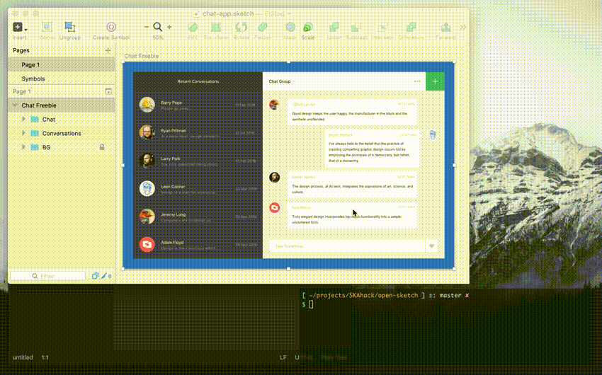

# Open Sketch

❗️❗️ This project is deprecated since Sketch 43. ❗️❗️

Please read http://sketchplugins.com/d/87-new-file-format-in-sketch-43.

Open Sketch is sketch to json exporter and json to sketch importer.


[Chat App Freebie https://dribbble.com/shots/2719193-Chat-App-Freebie](https://dribbble.com/shots/2719193-Chat-App-Freebie)

:baby_chick: experimental project

## Motivation

Design file can not be use the features of version control system (e.g. diff, merge and collaboration).

## Usage

1, clone this repository.

```sh
$ git clone https://github.com/SKAhack/open-sketch.git
$ cd path/to/open-sketch # pointing at cloned directory
```

2, npm install.

```sh
$ npm install
```

3, Open your Sketch file.

4, Export and Import.

```sh
$ npm start
```

5, Done. Sketch file export to `documents` directory.

## TODO

see [Issues](https://github.com/SKAhack/open-sketch/issues)

## License
MIT
